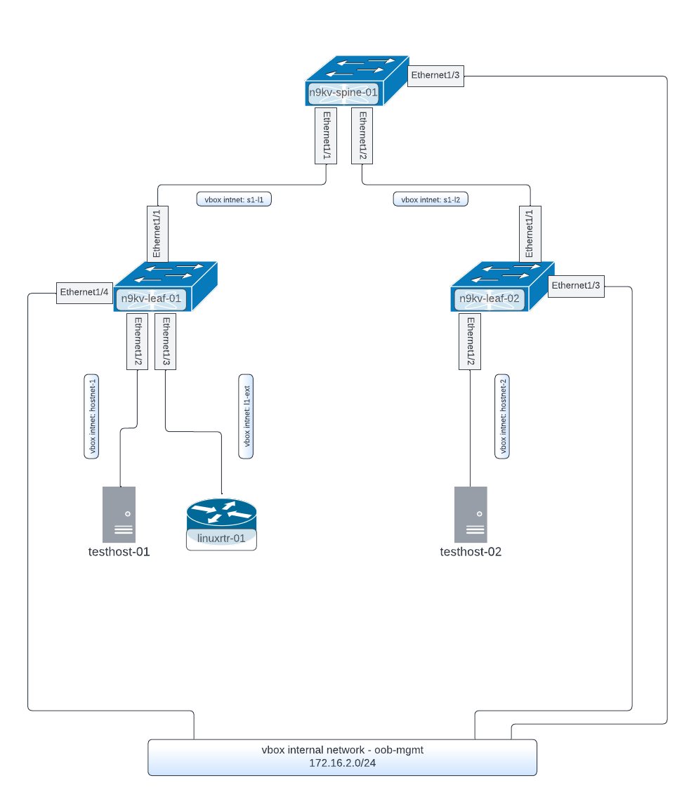

# Overview
This project provides a Vagrantfile and base configurations for a 1 Spine, 2 Leaf Nexus 9000v topology.  It configures the connections between the spine and leafs, an out-of-band management network (to which other VMs such as Netbox and Ansible can be connected), a pair of test hosts, and external Linux "router".

## Requirements

* [Vagrant](https://www.vagrantup.com/)
* [VirtualBox](https://www.virtualbox.org/)
* A Nexus 9300v Vagrant Box.  Unfortunately we cannot provide this, so you will need to download it off of the Cisco website.  We tested it using the n9kv 10.2.x and 10.3.x versions which seem to work better because they boot into Bash instead of Vsh.  After you have downloaded the box, you'll need to manually add it to the local store, e.g.:

```
    vagrant box add /path/to/downloaded/box/nexus9300v64.10.3.1.F.box --name n9kv-v10-3
```

The box name in the Vagrantfile is ```n9kv-v10-3``` so if you name it something else when you add it you will need to modify the Vagrantfile accordingly.

## Building and Testing the Topology

Getting the topology online initially should be as easy as cloning this repository and doing a ```vagrant up```. 

## Topology Drawing




